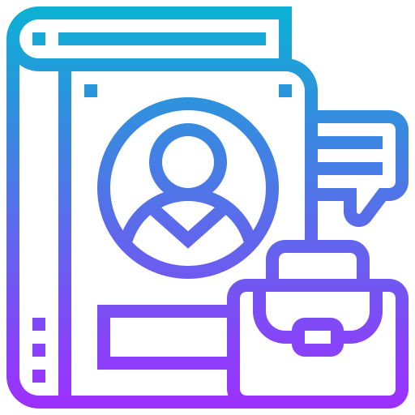

# 🚀 Mohamed Omara Portfolio

<div align="center">
  
</div>

## 📋 About

A modern, responsive portfolio website showcasing Mohamed Omara's skills, projects, and professional experience as a Software Engineer and Frontend Developer. Built with React, TypeScript, and Tailwind CSS, featuring a clean and professional design.

## ✨ Features

- 🎨 Modern UI with responsive design
- 🌙 Clean and professional layout
- 📱 Mobile-friendly interface
- 🔍 Project filtering by technology
- 📊 Skills visualization
- 📝 Detailed project descriptions
- 📈 Professional experience timeline
- 📬 Contact form

## 🛠️ Technologies Used

<div align="center">

  
  
  
  
  

</div>

- **Frontend Framework**: React with TypeScript
- **Build Tool**: Vite
- **Styling**: Tailwind CSS
- **UI Components**: shadcn/ui
- **Icons**: Lucide React
- **Routing**: React Router
- **State Management**: React Hooks
- **Form Handling**: React Hook Form
- **Data Fetching**: TanStack Query

## 🚀 Getting Started

### Prerequisites

- Node.js (v16 or higher)
- npm or yarn

### Installation

1. Clone the repository:
   ```bash
   git clone https://github.com/omara2001/Omara-Portfolio.git
   cd Omara-Portfolio
   ```

2. Install dependencies:
   ```bash
   npm install
   # or
   yarn install
   ```

3. Start the development server:
   ```bash
   npm run dev
   # or
   yarn dev
   ```

4. Open your browser and navigate to:
   ```
   http://localhost:8080
   ```

## 📂 Project Structure

```
Omara-Portfolio/
├── public/
│   └── Assets/         # Images and static assets
├── src/
│   ├── components/     # React components
│   │   ├── ui/         # UI components from shadcn/ui
│   │   └── ...         # Custom components
│   ├── lib/            # Utility functions
│   ├── pages/          # Page components
│   ├── App.tsx         # Main App component
│   ├── index.css       # Global styles
│   └── main.tsx        # Entry point
├── index.html          # HTML template
├── package.json        # Dependencies and scripts
├── tailwind.config.ts  # Tailwind CSS configuration
├── tsconfig.json       # TypeScript configuration
└── vite.config.ts      # Vite configuration
```

## 🌐 Deployment

This project can be easily deployed using various platforms:

1. **GitHub Pages**:
   - Build the project: `npm run build`
   - Deploy using GitHub Pages

2. **Vercel/Netlify**:
   - Connect your repository
   - Configure build settings
   - Deploy automatically

3. **Custom Domain**:
   - Follow the platform-specific instructions to connect your domain

## 📞 Contact

- **GitHub**: [github.com/omara2001](https://github.com/omara2001)
- **LinkedIn**: [linkedin.com/in/mohamed-omara-aa351520b](https://linkedin.com/in/mohamed-omara-aa351520b)
- **Email**: madayasser6@gmail.com

## 📄 License

This project is licensed under the MIT License - see the LICENSE file for details.

---

<div align="center">
  <p>Made with ❤️ by Mohamed Omara</p>
</div>
